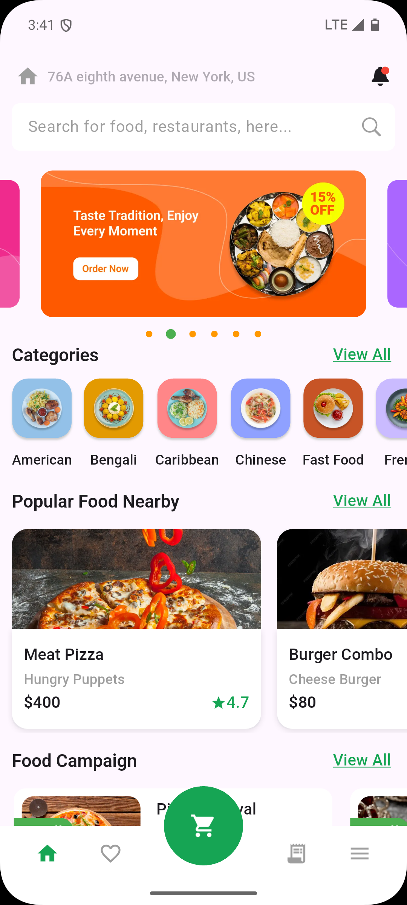
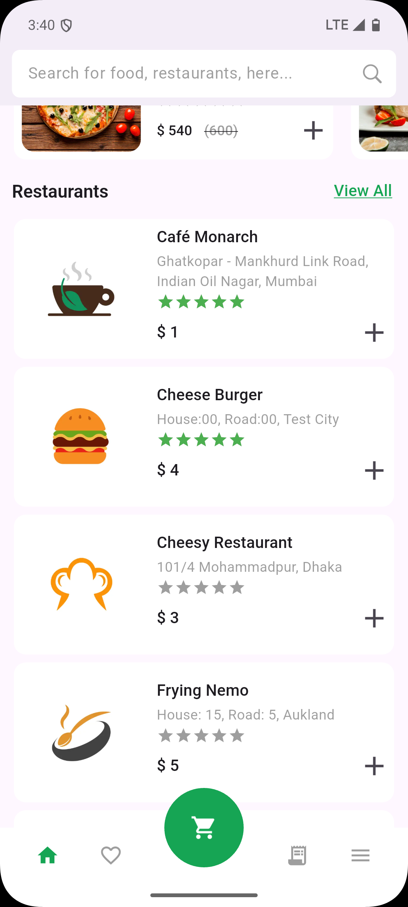

# stackfood assignment

A Flutter project that displays a list of restaurants, categories, and popular food items using the
public StackFood API.

## Getting Started

Follow these steps to set up and run the app on your local machine.

## Prerequisites

Before you begin, ensure you have the following installed on your computer:

- [Flutter](https://flutter.dev/docs/get-started/install) (Ensure you have Flutter SDK installed and
  configured correctly)
- [Dart](https://dart.dev/get-dart) (Dart is required by Flutter)
- [Xcode](https://developer.apple.com/xcode/) (for iOS development, if you're on a Mac)
- [Android Studio](https://developer.android.com/studio)
  or [Visual Studio Code](https://code.visualstudio.com/) (to edit and run the Flutter project)

## Installation

1. Clone the repository to your local machine:

    ```bash
    git clone https://github.com/msiprime/6amtask.git
    ```

2. Navigate to the project directory:

    ```bash
    cd 6amtask
    ```

3. Install the dependencies:

    ```bash
    flutter pub get
    ```
4. Run the app (on Mobile):

    ```bash
    flutter run
   ```

5. Run the app (on Web):

    ```bash
    flutter run -d chrome --web-renderer html
   ```

6. Build the app:

    ```bash
    flutter build apk --release
   ```

The Apk can be found in the build/app/outputs/flutter-apk directory

## Screenshots

Here are some screenshots of the app to give you a preview of its user interface:

<div style="display: flex;">
  
  
</div>

## Project Architecture

The app follows **Clean Architecture** with the following key layers:

### 1. **Data Layer**

The data layer is responsible for interacting with external data sources like APIs or local
databases.

- **Data Sources**: Handles fetching data from external APIs.
- **Repositories**: Implements the repository of domain layer, Modifies the data fetched in
  datasources.
- **Models**: Represents the data models used in the app.

In this project, data is fetched from the public StackFood API.

### 2. **Domain Layer**

The domain layer contains the business logic of the application. It consists of:

- **Entities**: Plain data objects used by the domain layer.
- **Repositories**: An abstraction of the repository layer used by bloc/cubit.

### 3. **Presentation Layer**

The presentation layer contains all the UI-related code and uses the BLoC (Business Logic Component)
pattern for state management.

- **Widgets**: Various UI components (like RestaurantCard).
- **View**: The view of that will be displayed (like Category View).
- **cubits**: Used to reflect the current state of the UI.

---

## API Endpoints Used

The app uses the following public API to fetch data:

- **Base URL**: [https://stackfood-admin.6amtech.com](https://stackfood-admin.6amtech.com)
- **Configuration Settings**: `/api/v1/config` (fetches image base)
- **Banners**: `/api/v1/banners`
- **Categories**: `/api/v1/categories`
- **Popular Food**: `/api/v1/products/popular`
- **Food Campaign**: `/api/v1/campaigns/item`
- **Restaurants**: `/api/v1/restaurants/get-restaurants/all?offset=1&limit=10` (Paginated)

#### Headers for API calls:

```json
{
  "Content-Type": "application/json; charset=UTF-8",
  "zoneId": "[1]",
  "latitude": "23.735129",
  "longitude": "90.425614"
}
